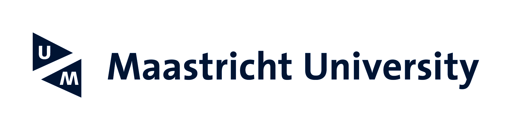

# FAIR essentials workshop

## Overview
> 📢 Learn how data can be managed to facilitate the discovery and reuse of data, for [humans](https://dbpedia.org/page/Human) and [machines](https://dbpedia.org/page/Machine).(2016, [FAIR Guiding Principles for data management and stewardship](https://www.nature.com/articles/sdata201618)). 📢

Digitalisation has had a considerable impact on the way we work in everyday life. What is more, this technological advancement has also resulted in a substantial increase of research data being produced worldwide. Research data transforms the way we live and work, so it’s becoming increasingly important that it’s stored and organized correctly. In parallel, the number of personas involved in a project are more diverse than ever - researchers, data stewards, librarians, data scientists and software developers - with all different digital skills.
Therefore, the concept of FAIR data management is currently a topic of interest within and beyond academia, with universities being increasingly aware of the need to provide trainings on data-driven methods for **doctoral candidates** , **early-career researchers** and **data stewards**. This interactive, online workshop will provide a platform to address the importance of FAIR data management practices for them and explore practicalities to make your research data FAIR.

## What will you achieve?

You’ll discover common research data management techniques, how to create FAIR data in practice, and how to develop your own research data management FAIR roadmap. By the end of this workshop you will be able to:

* ✔️ Demonstrate the concept of FAIR and its applications in research data management.
* ✔️✔️ Articulate benefits, barriers and challenges in making data and other outputs FAIR. 
* ✔️✔️✔️ Gain hands-on experience with techniques, services and technologies to make your data or help other make their data FAIR.

## Who is the course for?

This course is aimed at individuals working with or expecting to work with research data as researchers, librarians, data stewards, and all of those aiming or determine to make their data FAIR.

## When is the course?

🧭**10th February 2021**🧭

## Syllabus

|Time| Topic | Duration|
|--|--|--|
|10:00| S1: Welcome to the workshop and Introductions | [15min]|
|10:15 |S2: The why, what and how of FAIR| [1hr] |
|11:15 |[Join](https://docs.google.com/presentation/d/10rHaOirXx3INgm6E5NZEGtryeBvdDWkpr7jHqGKXjSg/edit?usp=sharing): FAIR Quiz I |[15min]|
|11:30 |Coffee break| [15 min]|
|11:45 |S3: Introduction to FAIR Activities| [15min]|
|12:00 |[Hands on Session](https://docs.google.com/document/d/1xOekDRW7tqTuaJ2EuNy_k1tdzYIotU6j_OJXdQbz-Mc/edit?usp=sharing) |[1hr] |
|13:00 |Lunch break|[1hr]|
|14:00 |Discussion Q&A FAIR experience| [15min]|
|14:15 |S4: Evaluating FAIRness| [30min]|
|14:45 |FAIR Quiz II| [15min]|
|15:00 |[S5](https://docs.google.com/presentation/d/1nEx1VvDAgLmlVALfo6wbLW6aobQqFoqie8hhHZiJVjU/edit?usp=sharing): The road to the *next* Science| [15min]|
|15:15 |S6: Wrap up, next steps and Workshop Evaluation| [15 min]|
|15:30 |end||

## Material and helpful resources

### Lectures:

* [Introduction](lectures/S1_Course_Overview.pdf)
* [FAIR Concept](lectures/S2_ FAIR_Concept.pdf)
* [Challenge 15 principles in 25 min](lectures/S3_15-principles-in-20 min.pdf)
* [UM Repositories](lectures/S_4_Repositories_FAIR_EJ.pdf)
* [FAIRness Evaluation](lectures/S5_FAIRness-Evaluation.pdf)
* [Next Science](lectures/S6_next_Science.pdf)

### Lab:

[Hands on Session](https://docs.google.com/document/d/1xOekDRW7tqTuaJ2EuNy_k1tdzYIotU6j_OJXdQbz-Mc/edit?usp=sharing)

### Others:

[IDS Best Practices - FAIR](https://maastrichtu-ids.github.io/best-practices/docs/fair-principles)

## Feedback form

Please provide us with your feedback, so we can continue to improve our workshops.

🍎 [Post-workshop feedback](https://form.typeform.com/c/U8ih72Zc?typeform-medium=embed-snippet)

## Communication

The **Slack workspace** will be  used to keep open for a further two weeks after the end of the course.

[Join us #fair-um-2023](https://fair-um-2023.slack.com/archives/C01KFA8MJUV)

## Who will you learn with?

* [Carlos Utrilla Guerrero](https://www.maastrichtuniversity.nl/p70069673)
* [Maria Vivas Romero]()
* [Ricardo Miranda Azevedo](https://www.maastrichtuniversity.nl/r.demirandaazevedo)
* [Erik Jansen](https://www.maastrichtuniversity.nl/erik.jansen)
* [Olav Palmen](https://www.maastrichtuniversity.nl/p70067301)

## Who develop the workshop?
All bodies involved in the [Community for Data-Driven Insights](https://library.maastrichtuniversity.nl/research-support/rdm/#cddi):
* [Institute of Data Science](https://www.maastrichtuniversity.nl/research/institute-data-science)
* [UM University Library](https://library.maastrichtuniversity.nl/)
* [Open Science Community]()

